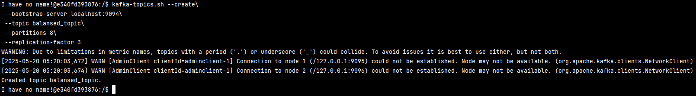
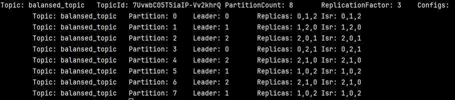
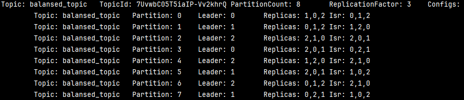
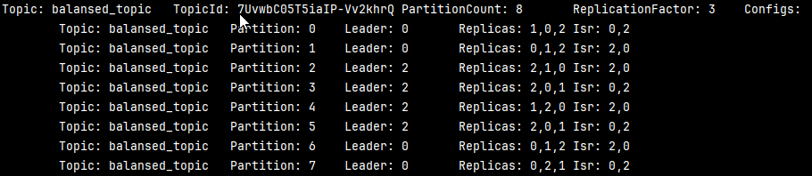

# Задание 1. Балансировка партиций и диагностика кластера
### 1) Создание топика
```bash
kafka-topics.sh --create\
    --bootstrap-server localhost:9094\
    --topic balansed_topic\
    --partitions 8\
    --replication-factor 3
```
Результат:


### 2) Распределение партиций
```bash
kafka-topics.sh --describe \
    --bootstrap-server localhost:9094 \
    --topic balansed_topic
```
Результат выполнения команды:


### 3) Перераспределение партиций

Для перераспределения выполняются следующие команды
```bash
cd tmp
```
```bash
echo '{
  "version": 1,
  "partitions": [
    {"topic": "balansed_topic", "partition": 0, "replicas": [1, 0, 2], "log_dirs": ["any", "any", "any"]},
    {"topic": "balansed_topic", "partition": 1, "replicas": [0, 1, 2], "log_dirs": ["any", "any", "any"]},
    {"topic": "balansed_topic", "partition": 2, "replicas": [2, 1, 0], "log_dirs": ["any", "any", "any"]},
    {"topic": "balansed_topic", "partition": 3, "replicas": [2, 0, 1], "log_dirs": ["any", "any", "any"]},
    {"topic": "balansed_topic", "partition": 4, "replicas": [1, 2, 0], "log_dirs": ["any", "any", "any"]},
    {"topic": "balansed_topic", "partition": 5, "replicas": [2, 0, 1], "log_dirs": ["any", "any", "any"]},
    {"topic": "balansed_topic", "partition": 6, "replicas": [0, 1, 2], "log_dirs": ["any", "any", "any"]},
    {"topic": "balansed_topic", "partition": 7, "replicas": [0, 2, 1], "log_dirs": ["any", "any", "any"]}
  ]
}' > reassignment.json
```
```bash
kafka-reassign-partitions.sh \
    --bootstrap-server localhost:9094 \
    --broker-list "0, 1, 3" \
    --topics-to-move-json-file "/tmp/reassignment.json" \
    --generate 
```
```bash
kafka-reassign-partitions.sh \
    --bootstrap-server localhost:9094 \
    --reassignment-json-file /tmp/reassignment.json \
    --execute
```

В результате получилось следующее распределение


### 4) Отключение реплики kafka-1


Запуск реплики kafka-1:


# Задание 2.

Выполнить команды, указанные в [commands.sh](task_two%2Fcommands.sh)

Cоздание топиков
```bash
kafka-topics --bootstrap-server localhost:9093 \
  --create \
  --topic topic-1 \
  --partitions 3 \
  --replication-factor 3
```
```bash
kafka-topics --bootstrap-server localhost:9092 \
  --create \
  --topic topic-2 \
  --partitions 3 \
  --replication-factor 3
```
Команды для топика *topic-1*
```bash
# Разрешаем запись (Producer)
kafka-acls --bootstrap-server localhost:9092 \
    --add --allow-principal User:'*' \
    --operation WRITE --topic topic-1

# Разрешаем чтение (Consumer)
kafka-acls --bootstrap-server localhost:9092 \
  --add --allow-principal User:'*' \
  --operation READ --topic topic-1

# Разрешаем доступ к группам (для Consumer)
kafka-acls --bootstrap-server localhost:9092 \
  --add --allow-principal User:'*' \
  --operation DESCRIBE --group '*'
```


Команды для топика *topic-2*
```bash
# Разрешаем запись (Producer)
kafka-acls --bootstrap-server localhost:9092 \
  --add --allow-principal User:'*' \
  --operation WRITE --topic topic-2

# Запрещаем чтение (Consumer)
kafka-acls --bootstrap-server localhost:9092 \
  --add --deny-principal User:'*' \
  --operation READ --topic topic-2
```